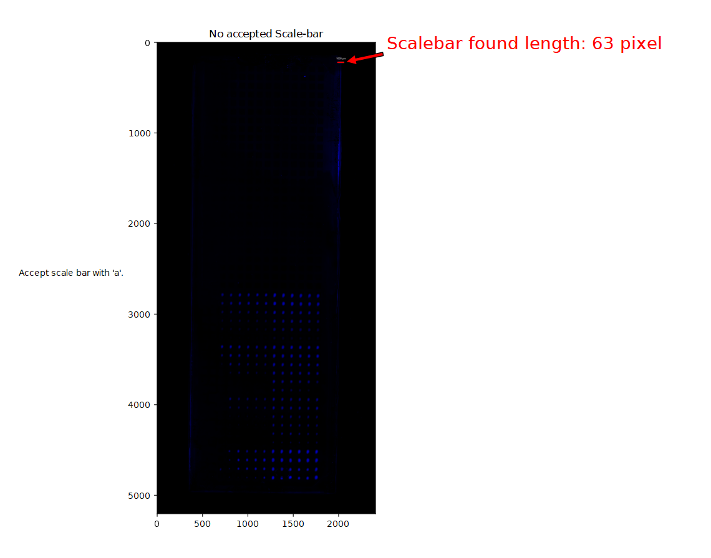
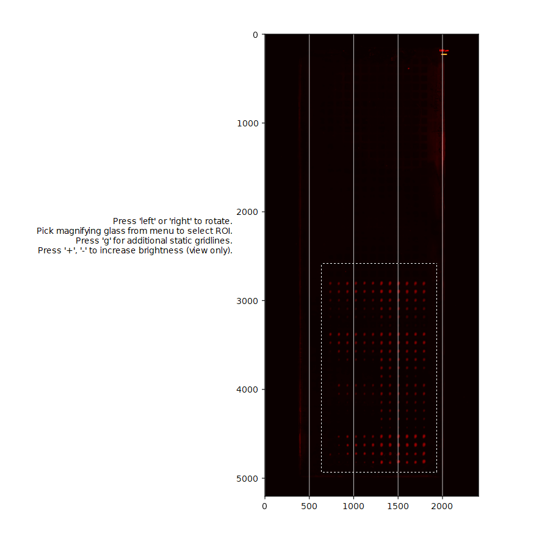
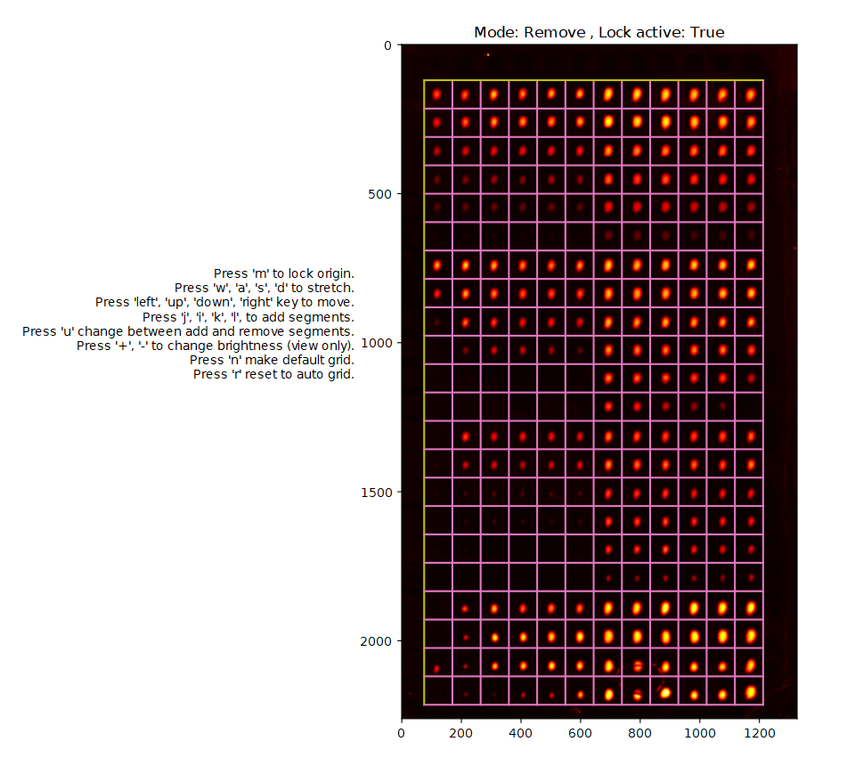
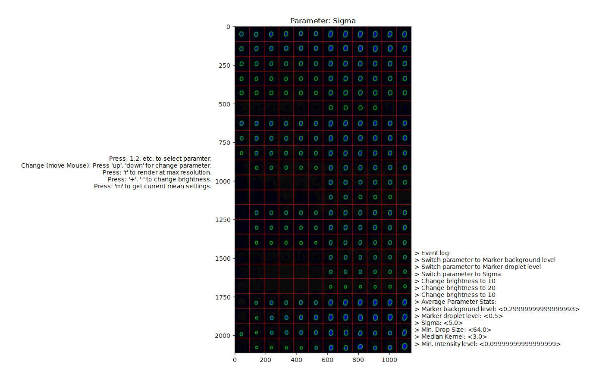

# Micro-droplet Segmentation in Microscopy Images

Semi-supervised tool for segmentation of micro-droplet arrays in microscopy images. 
This data analysis tool was developed to automatically detect and evaluate droplet stained by fluorescence markers.

# Requirements 

Required packages for this project can be installed with ``pip`` and are listed below. 
The GUI uses ``matplotlib`` and image processing is handled by `opencv` and `skimage`. 
The code is tested on Windows machines to run on lab computers, where python is available in system PATH environment variable!

```shell
python -m pip install opencv-python
python -m pip install openpyxl
python -m pip install matplotlib
python -m pip install scikit-image
```

# Implementation details

The main program of ``main.py``, executed with `RUN.bat` or `python main.py` runs over all images in "input/" folder 
and creates an equally named output folder in "output/". For each image a series of individual python modules is called,
which can also be used independently but may require input from the previous module. 
Modules are ``ImageSelection.py``, ``FindScaleBar.py``, ``GridSegmentation.py`` and ``DropletSeparation.py``.
General-use classes are given in ``grid.py`` and `image.py`. 
Each module opens a "Qt5Cairo" interactive backend of `matplotlib`. Press "enter" to accept and continue.


# Usage

With ``main.py`` the sequence of the following scripts is executed for each image in `./input` .
Note that the scripts may require output from the previous script. To accept and continue to the next step press 'enter'.
Interactive help and key bindings is usually plotted on the left.

### FindScaleBar.py

First is an optional scale bar information. If the scale bar is detected properly, you can accept its value with 'a'.
The information is stored in 'ScaleBar.yaml'. The detection algorithm is a hard-coded simple search routine.



### ImageSelection.py

The image selection allows to remove some boundaries and to pick an image selection and to rotate the image if the image was not aligned.
Increasing brightness and contrast is only for show, but does not alter image information. With 'g' you can activate grid lines to guide the eye.



### GridSegmentation.py




### DropletSeparation.py

